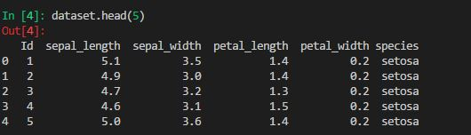
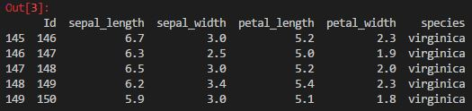
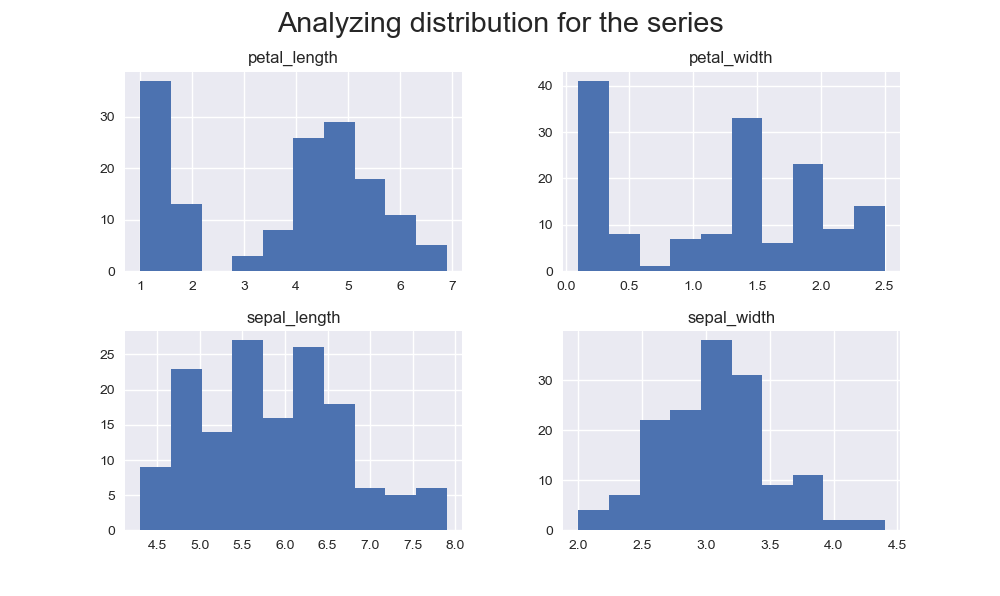

# Programming-Scripting-Project-18
This repository contains a project which focuses on the Fisher's Iris data set. The project requires researching the data set, and then writing documentation and code in the [Python](https://www.python.org/) programming language based on that research. 

### Introduction
The Iris flower data set or Fisher's Iris data set is a multivariate data set introduced by the British statistician and biologist Ronald Fisher in his 1936 paper *The Use of Multiple Measurements in Taxonomic Problems* as an example of linear discriminant analysis. It is sometimes called Anderson's Iris data set because Edgar Anderson collected the data to quantify the morphologic variation of Iris flowers of three related species. Two of the three species were collected in the Gaspé Peninsula all from the same pasture, and picked on the same day and measured at the same time by the same person with the same apparatus. [[1]](https://en.wikipedia.org/wiki/Iris_flower_data_set)

The iris dataset contains measurements for 150 iris flowers from three different species.The three species in the Iris dataset are:
 * Iris-setosa 
 * Iris-versicolor 
 * Iris-virginica 

The four features of the Iris dataset:
 * sepal length in cm
 * sepal width in cm
 * petal length in cm
 * petal width in cm

Based on the combination of these four features, Fisher developed a linear discriminant model to distinguish the species from each other. [[1]](https://en.wikipedia.org/wiki/Iris_flower_data_set)


### Importance of Fisher's Iris Data Set
Fisher’s Iris data set became a staple of the computing world, especially for testing purposes. The Iris dataset is widely used throughout statistical science, especially for illustrating various problems in statistical graphics, multivariate statistics and machine learning.

The reason why this is widely used for testing purposes:
* It contains 150 observations, it is small but not trivial.
* The task it poses of discriminating between three species of Iris from measurements of their petals and sepals is simple but challenging.
* The data is real data, of good quality. In principle and in practice, test datasets could be synthetic and that might be necessary or useful to make a point. [[2]](https://stats.stackexchange.com/questions/74776/what-aspects-of-the-iris-data-set-make-it-so-successful-as-an-example-teaching)
	

### Getting Started
##### Downloading the Iris Data Set
 1. Go to [UCI](https://archive.ics.uci.edu/ml/datasets/iris) 
 2. Click on the Data Folder [link](https://archive.ics.uci.edu/ml/machine-learning-databases/iris/)
 3. Click on the [iris.data](https://archive.ics.uci.edu/ml/machine-learning-databases/iris/iris.data)
 4. Copy this to excel and save in a local folder.
 
 
##### Installing Downloads
[Python](https://www.python.org/) is receommended to run these programs. In order to get started we must download [Anaconda](https://www.anaconda.com/download/) and then [VS Code](https://code.visualstudio.com/).

[Anaconda](https://www.anaconda.com/download/) is a free and open source distribution of the Python and R programming languages for large-scale data processing, predictive analytics, and scientific computing, that aims to simplify package management and deployment.

[VS Code](https://code.visualstudio.com/). is a source code editor developed by Microsoft for Windows, Linux and MacOS. It includes support for debugging, embedded Git control, syntax highlighting, intelligent code completion, snippets, and code refactoring. [[10]](https://en.wikipedia.org/wiki/Visual_Studio_Code)

Step by step guide for downloading [Python](https://www.python.org/):
 1. Open [Python](https://www.python.org/)
 2. Download version Python [3.6.5](https://www.python.org/downloads/)
 3. Follow the instructions on screen - unsure about settings accept the default settings.
 
Step by step guide for downloading [Anaconda](https://www.anaconda.com/download/):
1. Open Anaconda Download
2. Click Python 3.6 version
3. Follow the instructions on screen - unsure about settings accept the default settings.
4. Once completed test installation

Step by step guide for downloading [VS Code](https://code.visualstudio.com/):
1. Open VS Studio DownloadN
2. Depending on your OS system - click the appropriate one ie Windows, Mac.
3. Follow the instructions on screen - unsure about settings accept the default settings.
4. Once completed run a simple program

#### Libraries Used for Analysis
1. [NumPy](http://www.numpy.org/) is the fundamental package for scientific computing with Python. It contains among other things:
 * a powerful N-dimensional array object
 * sophisticated (broadcasting) functions
 * tools for integrating C/C++ and Fortran code
 * useful linear algebra, Fourier transform, and random number capabilities
Besides its obvious scientific uses, NumPy can also be used as an efficient multi-dimensional container of generic data. Arbitrary data-types can be defined. This allows NumPy to seamlessly and speedily integrate with a wide variety of databases.

2. [Matplotlib](https://matplotlib.org/) is a Python 2D plotting library which produces publication quality figures in a variety of hardcopy formats and interactive environments across platforms. Matplotlib can be used in Python scripts, the Python and IPython shells, the Jupyter notebook, web application servers, and four graphical user interface toolkits.

3. [Pandas](https://pandas.pydata.org/) is an open source, BSD-licensed library providing high-performance, easy-to-use data structures and data analysis tools for the Python programming language.

4. [Seaborn](https://seaborn.pydata.org/) Seaborn is a Python visualization library based on matplotlib. It provides a high-level interface for drawing attractive statistical graphics.


### Python Programme
We begin my importing the librares that are needed to analysis the iris data set.

```import numpy as np
import seaborn as sns
import matplotlib.pyplot as plt
sns.set(color_codes=True)
import pandas as pd
import pylab
from mpl_toolkits.mplot3d import Axes3D
```

Next import the iris data set into [VSC](https://code.visualstudio.com/) so the data can be read and analysed using [Panda](https://pandas.pydata.org/)

```data = pd.read_csv('project/Iris.data.csv')```

Our first piece of analysis is requesting the top and bottom lines of the data set shown in the images below.




 

 We look at the types of species included and the lenght of the data set which we are analysing 
 
 ``` species = list(data["species"].unique())```
 
 ``` print("Dataset length: %i\n" % len(data))```
 
 Using the panda tool we create a table which includes the min, max and mean as well as other relevant data
 
 

 
 Next we create a histogram analyzing dsitribution for the data set
 
 
 
 We create scatterplot that shows the ratio between the width and length of both sepal leaves and petal leaves. 
 
  
  
  
  
  We create a three 3D plot to show the correlation of the iris data set.
  
  
 
 We then create a seaborn pairplot. 
 
 
 
 And finally creating violinplots for each petal and sepal, lenght and width.
 


## Write a summary of your investigation
We begin by downloading the the Iris data set from [UCI](https://archive.ics.uci.edu/ml/datasets/iris) and we discovered that we are analysing 150 lines of data made up of 3 different types of species of iris; setosa, versicolor and virginica. 

Using [Pandas](https://pandas.pydata.org/) a data analysis tools for the Python programming language, we create a data table. Included in this table, are count, mean, standard deviation, min , 25%, 50%, 75% and finally max. From this table, we identify that the sepal length is the longest in centimetres with the average being 5.843333 while the petal width is the shortest in centimetres with the averaging being 1.198667.

Looking at the standard deviation, petal length is the furthest away from the mean at 1.764420 while sepal width has the least deviation from the mean at 0.433594

Our histogram shows both the petal lenght and width are left skewed meaning that the majoruty is greater than the mean while the sepal lenght and width has a bell shaped i.e. shape is symmetrical meaning the majority are relative close to the mean.

Next up are the scatter plots,the setosa is linearly separable from the other two species, but the other two species are not linearly separable from each other. [[4]](https://www.kaggle.com/uciml/iris) The plots clearly show the virginica variety of plants have the greatest petal lengths and widths of the three, while the setosa variety has the smallest.The virginica variety also have the greatest sepal lengths but the setosa variety have greatest sepal widths.The versicolor plants seem to lie in the middle ranges of all the measurements taken.[[5]](https://rpubs.com/mculp/290780)

3D scatter plots are used to plot data points on three axes in the attempt to show the relationship between three variables. Each row in the data table is represented by a marker whose position depends on its values in the columns set on the X, Y, and Z axes. [[6]](https://docs.tibco.com/pub/spotfire/6.5.1/doc/html/3d_scat/3d_scat_what_is_a_3d_scatter_plot.htm). Our scatterplot indicates petal width is shorter than the petal and sepal length which we have also seen earlier in this anaylsis.

Seaborn pairplot function creates a grid of axes such that each variable in data will by shared in the y-axis across a single row and in the x-axis across a single column [[3]](https://seaborn.pydata.org/generated/seaborn.pairplot.html). This is very useful to show the correlation of all variales against each other.
 
A violin plot has four layers. The outer shape represents all possible results, with thickness indicating how common. (Thus the thickest section represents the mode average.) The next layer inside represents the values that occur 95% of the time. The next layer (if it exists) inside represents the values that occur 50% of the time. The central dot represents the median average value.[[7]](https://en.wikipedia.org/wiki/Violin_plot). From our violin plots we can see that the setosa has a completely different shape than the other two species. Virginica is longer than versicolor in relation to the petal length. The same is true of the sepal length. Versicolor and virginica species have similair means for sepal width. but sepal width for the setosa is longer than the other two species which is a change from the rest of the other categories. 

To summarise our analysis this is a type of Linear Discriminant Analysis (LDA). LDA a method used in statistics, pattern recognition and machine learning to find a linear combination of features that characterizes or separates two or more classes of objects or events. [[9]](https://en.wikipedia.org/wiki/Linear_discriminant_analysis). As we can see, Fisher's iris data set provides a good testing envirnoment to run LDA and for someone beginning a new programming language it has all the elements needed to perfrom new skills learnt.


## Referencest
1. https://en.wikipedia.org/wiki/Iris_flower_data_set

2. https://stats.stackexchange.com/questions/74776/what-aspects-of-the-iris-data-set-make-it-so-successful-as-an-example-teaching

3. https://seaborn.pydata.org/generated/seaborn.pairplot.html

4. https://www.kaggle.com/uciml/iris

5. https://rpubs.com/mculp/290780

6. https://docs.tibco.com/pub/spotfire/6.5.1/doc/html/3d_scat/3d_scat_what_is_a_3d_scatter_plot.htm

7. https://en.wikipedia.org/wiki/Violin_plot

8. https://www.kaggle.com/danalexandru/simple-analysis-of-iris-dataset

9. https://en.wikipedia.org/wiki/Linear_discriminant_analysis

10.https://en.wikipedia.org/wiki/Visual_Studio_Code

### Built With
This repository contains Python code only.

### Licence
This project is licensed under the Apache License 2.0

### Acknowledgements
 - Thanks to the users of stackflow and kaggle for their assistance
